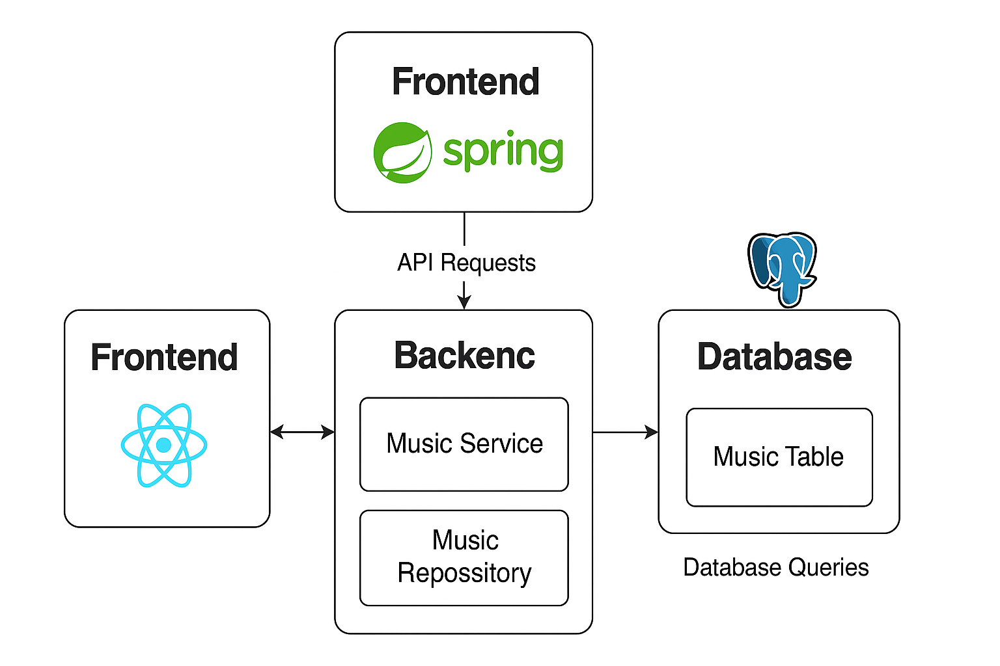

# 🎵 Aura

Aplicação de streaming de músicas com **backend em Java Spring Boot**, **frontend em React** e integração via **Docker Compose**.

---

## 📌 Sumário

1. [Visão Geral](#-visão-geral)
2. [Arquitetura](#-arquitetura)
3. [Tecnologias Utilizadas](#-tecnologias-utilizadas)
4. [Banco de Dados](#-banco-de-dados)
5. [API - Endpoints](#-api---endpoints)
6. [Frontend](#-frontend)
7. [Execução do Projeto](#-execução-do-projeto)
8. [Melhorias Futuras](#-melhorias-futuras)

---

## 🚀 Visão Geral

O **Aura** é um sistema que permite gerenciar músicas, listá-las e consumir via interface web. O backend expõe uma **API RESTful**, e o frontend em React consome essa API para exibir os dados ao usuário.

---

## 🏗 Arquitetura





* **Frontend**: Interface em React que consome a API.
* **Backend**: Java Spring Boot, responsável pelas regras de negócio e exposição dos endpoints.
* **Database**: PostgreSQL configurado via `schema.sql`.

---

## 🛠 Tecnologias Utilizadas

### Backend (Java Spring Boot)

* Java 17+
* Spring Boot
* Spring Data JPA
* PostgreSQL Driver
* Maven

### Frontend (React)

* React 18+
* Axios (requisições HTTP)
* CSS modules

### Infraestrutura

* Docker
* Docker Compose

---

## 🗄 Banco de Dados

Estrutura básica definida em `schema.sql`:

```sql
CREATE TABLE music (
    id SERIAL PRIMARY KEY,
    title VARCHAR(255) NOT NULL,
    artist VARCHAR(255) NOT NULL,
    album VARCHAR(255),
    year INT
);
```

---

## 📡 API - Endpoints

### Base URL: `http://localhost:8080/api/music`

| Método | Endpoint          | Descrição                       |
| ------ | ----------------- | ------------------------------- |
| GET    | `/api/music`      | Retorna todas as músicas        |
| GET    | `/api/music/{id}` | Retorna uma música pelo ID      |
| POST   | `/api/music`      | Cria uma nova música            |
| PUT    | `/api/music/{id}` | Atualiza os dados de uma música |
| DELETE | `/api/music/{id}` | Remove uma música do sistema    |

### Exemplo de JSON (POST/PUT)

```json
{
  "title": "Imagine",
  "artist": "John Lennon",
  "album": "Imagine",
  "year": 1971
}
```

---

## 🎨 Frontend

* Implementado em React.
* `MusicList.jsx`: lista músicas consumindo a API.
* `App.js`: ponto de entrada do sistema.
* Integração via Axios com o backend.

---

## ▶ Execução do Projeto

### 1. Via Docker Compose

```bash
docker-compose up --build
```

* Backend sobe em: `http://localhost:8080`
* Frontend sobe em: `http://localhost:3000`
* Banco de dados PostgreSQL na porta `5432`

### 2. Manualmente

#### Backend

```bash
cd backend
mvn spring-boot:run
```

#### Frontend

```bash
cd frontend
npm install
npm start
```

---

## 🚀 Melhorias Futuras

* Autenticação e autorização de usuários.
* Upload e armazenamento de músicas.
* Criação de playlists personalizadas.
* Testes unitários e de integração (JUnit, React Testing Library).
* Deploy em cloud (AWS, GCP ou Azure).

---

📌 **Autor**: Gustavo Costa
